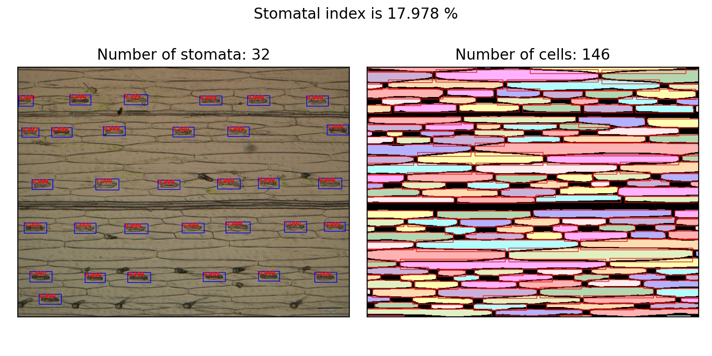

# Deep learning pipeline for stomatal index measurement


## Start
First of all, clone the code
```shell script
git clone https://github.com/WeizhenLiuBioinform/stomatal_index.git
```
## Prerequisites
* Python 3.7
* Pytorch 1.5
* CUDA 10.0 or higher
* Opencv
* ...

The complete list of the required python packages and their version information can be found at requirements.txt
## FRcnn_pytorch

### Stoamtal Data Preparation
* **PASCAL_VOC format**: Please follow the instructions in [py-faster-rcnn](https://github.com/rbgirshick/py-faster-rcnn#beyond-the-demo-installation-for-training-and-testing-models) to prepare stomatal datasets.

### ResNet101 Pretrained Model
* ResNet101: [Dropbox](https://www.dropbox.com/s/iev3tkbz5wyyuz9/resnet101_caffe.pth?dl=0), [VT Server](https://filebox.ece.vt.edu/~jw2yang/faster-rcnn/pretrained-base-models/resnet101_caffe.pth)
Download them and put it into the FRcnn_pytorch/data/pretrained_model/.

### Compilation
```shell script
cd FRcnn_pytorch/lib
python setup.py build develop
```

### FRcnn_Train
Configure your own settings in FRcnn_pytorch/cfgs/train.yml to adapt to your environment.
To train a Faster R-CNN model with pascal_voc format, simply run:
```shell script
python Frcnn_train.py
```

## UNet_pytorch
### Cell Data Preparation
* Put images into the UNet_Pytorch_pytorch/data/imgs/
* Put masks into the FRcnn_pytorch/data/masks/

### UNet_Train
Configure your own settings in UNet_pytorch/cfgs/train.yml to adapt to your environment.
To train a U-Net model, simply run:
```shell script
python UNet_train.py
```

## Stomatal index measurement
Change the arguments "image_dir", "frcnn_load_name" and "unet_load_name" in "stomatal_index.py" to adapt to your environment.

```shell script
python stomatal_index.py
```
If you want to visualize the prediction results of stomata and cells, you can set the parameter "is_vis = True", which means that extra time will be consumed.

## Citation
If you use this code and data in a publication, please cite it as:

* Zhu C, Hu Y, Mao H, Li S, Li F, Zhao C, Luo L, Liu W and Yuan X (2021) A Deep Learning-Based Method for Automatic
  Assessment of Stomatal Index in Wheat Microscopic Images of Leaf Epidermis. Front. Plant Sci. 12:716784. doi:
  10.3389/fpls.2021.716784
